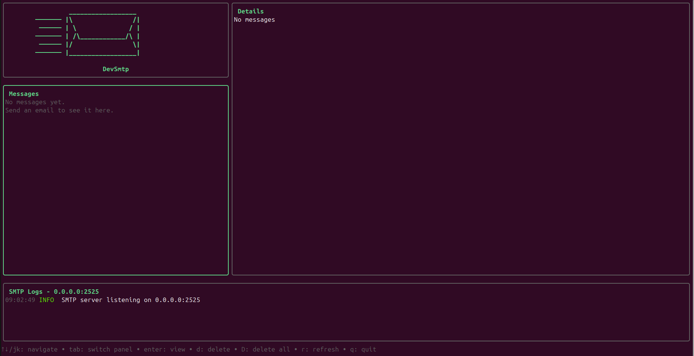

# DevSmtp

[](https://go.dev/)
[](LICENSE)
[](https://github.com/lawnchairsociety/devsmtp/actions)
[](https://goreportcard.com/report/github.com/lawnchairsociety/devsmtp)


A lightweight SMTP server for developers to test email functionality in their applications. DevSmtp captures all emails sent to it and stores them in a SQLite database, providing a terminal-based UI for viewing and managing messages.



## Features

- **Full SMTP Support** - Implements all standard SMTP commands (HELO, EHLO, MAIL FROM, RCPT TO, DATA, RSET, NOOP, QUIT, VRFY, EXPN)
- **STARTTLS Support** - Optional TLS encryption via STARTTLS
- **Configurable Authentication** - SMTP AUTH support with configurable credentials (optional or required)
- **SQLite Storage** - All messages stored locally in a SQLite database
- **Terminal UI** - Built-in TUI for browsing and inspecting captured emails
- **Flexible Configuration** - Configure via CLI flags, environment variables, or config file

## Installation

### From Source

```bash
git clone https://github.com/lawnchairsociety/devsmtp.git
cd devsmtp
go build -o devsmtp ./cmd/devsmtp
```

### Go Install

```bash
go install github.com/lawnchairsociety/devsmtp/cmd/devsmtp@latest
```

## Usage

```bash
# Start with default settings (port 587)
devsmtp

# Start on a custom port
devsmtp --port 2525

# Start with authentication required
devsmtp --auth-required --auth-user testuser --auth-pass testpass
```

This launches both the SMTP server and the terminal UI. The TUI displays incoming emails in real-time.

## Configuration

DevSmtp can be configured through CLI flags, environment variables, or a configuration file. Priority order: CLI flags > environment variables > config file > defaults.

### CLI Flags

| Flag | Description | Default |
|------|-------------|---------|
| `--port` | SMTP server port | `587` |
| `--host` | SMTP server bind address | `0.0.0.0` |
| `--db` | SQLite database path | `./devsmtp.db` |
| `--auth-required` | Require SMTP authentication | `false` |
| `--auth-user` | Username for SMTP AUTH | `` |
| `--auth-pass` | Password for SMTP AUTH | `` |
| `--tls-cert` | Path to TLS certificate | `` |
| `--tls-key` | Path to TLS private key | `` |
| `--config` | Path to config file | `./devsmtp.yaml` |

### Environment Variables

| Variable | Description |
|----------|-------------|
| `DEVSMTP_PORT` | SMTP server port |
| `DEVSMTP_HOST` | SMTP server bind address |
| `DEVSMTP_DB` | SQLite database path |
| `DEVSMTP_AUTH_REQUIRED` | Require SMTP authentication |
| `DEVSMTP_AUTH_USER` | Username for SMTP AUTH |
| `DEVSMTP_AUTH_PASS` | Password for SMTP AUTH |
| `DEVSMTP_TLS_CERT` | Path to TLS certificate |
| `DEVSMTP_TLS_KEY` | Path to TLS private key |

### Config File

Create a `devsmtp.yaml` file:

```yaml
server:
  host: "0.0.0.0"
  port: 587

database:
  path: "./devsmtp.db"

auth:
  required: false
  username: ""
  password: ""

tls:
  cert: ""
  key: ""
```

## SMTP Commands

DevSmtp implements the following SMTP commands per RFC 5321:

| Command | Description |
|---------|-------------|
| `HELO` | Identify client (basic) |
| `EHLO` | Identify client (extended) |
| `MAIL FROM` | Specify sender address |
| `RCPT TO` | Specify recipient address |
| `DATA` | Begin message content |
| `RSET` | Reset session state |
| `NOOP` | No operation (keep-alive) |
| `QUIT` | End session |
| `VRFY` | Verify address (returns 252) |
| `EXPN` | Expand mailing list (returns 252) |
| `STARTTLS` | Upgrade to TLS connection |
| `AUTH` | Authenticate (PLAIN, LOGIN) |

## TUI Features

The terminal UI provides:

- List view of all captured emails
- View full email headers and body
- Delete individual or all messages
- Real-time updates as new emails arrive

## Database Schema

Messages are stored in SQLite with the following schema:

```sql
CREATE TABLE messages (
    id INTEGER PRIMARY KEY AUTOINCREMENT,
    sender TEXT NOT NULL,
    recipients TEXT NOT NULL,
    subject TEXT,
    body TEXT,
    raw_data BLOB,
    size INTEGER NOT NULL DEFAULT 0,
    client_ip TEXT,
    is_read BOOLEAN NOT NULL DEFAULT 0,
    created_at DATETIME DEFAULT CURRENT_TIMESTAMP
);

CREATE INDEX idx_messages_created_at ON messages(created_at);
CREATE INDEX idx_messages_is_read ON messages(is_read);
```

## Development

### Prerequisites

- Go 1.21 or later

### Building

```bash
go build -o devsmtp ./cmd/devsmtp
```

### Running Tests

```bash
go test ./...
```

## License

MIT License - see [LICENSE](LICENSE) for details.
